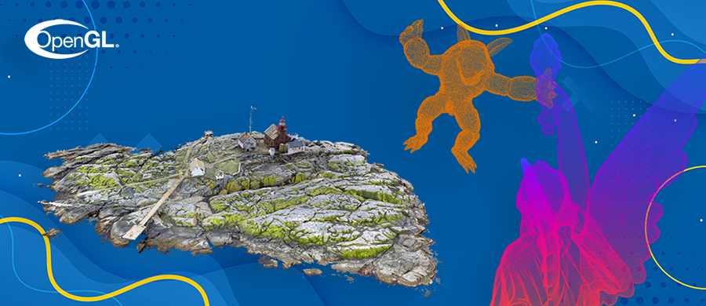
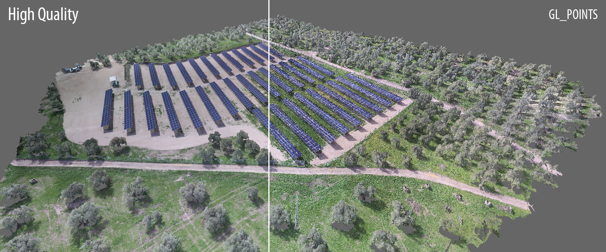
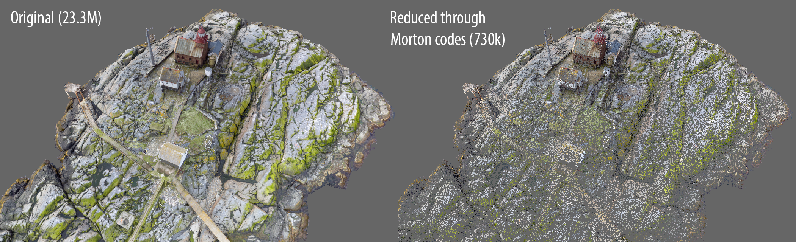
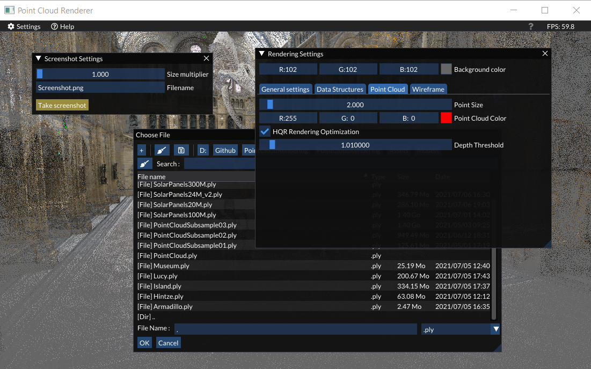

# Rendering of large point clouds   

> [!IMPORTANT]
> We have recently published a work to render huge point clouds, containing up to several billion points (tested with 18B points). It is available in **[https://github.com/Krixtalx/Nimbus](https://github.com/Krixtalx/Nimbus)**!
> 
This work is intended to provide fast rendering of large point clouds in OpenGL using compute shaders. It is built over an interface based on ImGui to ease the opening and visualization of large point clouds with a high frame rate per second (FPS). This work is based on Markus Schütz's research.

  

___
## Features

* The provided project opens large point clouds limited by the GPU's memory size. The maximum allowed size of a Shader Storage Buffer Objects (SSBO) is far behind the GPU's capabilities, so the point clouds are partitioned into several chunks. **Point clouds of several gigabytes may not be rendered in this application.**

* Beyond opening large point clouds, the base work of Markus Schütz allows improving the visualisation of point clouds through the latest extensions of compute shaders. See the image below to compare the enhancement to GL_POINTS rendering mode.

  

* As an alternative for large point clouds that cannot be completely loaded into the GPU, we provide a tool for reducing the size of a point cloud. For that purpose, points are sorted along a _z_-curve to narrow surrounding points into a single one.

  

* Take screenshots with a higher resolution than the current viewport size. By default, they are saved as Screenshot.png under the root directory, though the size multiplier and path destination should be configured.

* Graphical User Interface (GUI) provided by the ImGui library to configure the visualisation of the environment as well as the loading stage.

  

___
## TODO

* Include a more refined reduction algorithm, as the neighbourhood reduction given by Morton codes is mainly driven by the precision of such values for representing close points.

* Translate the code to CUDA/Vulkan, as it might severely improve the performance.

___
### Dependencies

`imgui: 1.82`
`glm: 0.9.9`
`glew`
`glfw: 3.3.0`
`openGL: ≥ 4.5`

___
### References

> Markus Schütz and Bernhard Kerbl and Michael Wimmer. 2021. **Rendering Point Clouds with Compute Shaders and Vertex Order Optimization**. [arXiv:2104.07526](https://arxiv.org/abs/2104.07526)

> Markus Schutz and Michael Wimmer. 2019. **Rendering Point Clouds with Compute Shaders**. In SIGGRAPH Asia 2019 Posters (SA '19). Association for Computing Machinery, New York, NY, USA, Article 32, 1–2. DOI: https://doi.org/10.1145/3355056.3364554
